# Diagrama de clases — modelo de datos

Generado a partir de las entidades TypeORM reales en `src/**/*.entity.ts` (no es un diseño aspiracional: refleja el código tal como quedó scaffoldeado). Las columnas de auditoría (`fechaHoraAlta`, `fechaHoraModificacion`, `fechaHoraBaja`) se muestran una sola vez en `BaseAuditEntity` en vez de repetirse en cada entidad que la extiende.

```mermaid
classDiagram
  class BaseAuditEntity {
    <<abstract>>
    +fechaHoraAlta: Date
    +fechaHoraModificacion: Date
    +fechaHoraBaja: Date?
  }

  class User {
    <<tabla: users>>
    +id: string
    +email: string
    +passwordHash: string
    +name: string
    +ministryRole: string
    +instruments: string[]
    +avatarColor: string
    +initials: string
  }

  class Role {
    <<tabla: roles>>
    +id: string
    +name: string
  }
  note for Role "Texto libre, creado por un admin desde la pantalla de administración — a propósito SIN @Check ni catálogo fijo, a diferencia de Tag.valor o del User.role original (ya eliminado)."

  class Tag {
    <<tabla: tags>>
    +id: string
    +valor: string
  }
  note for Tag "CHECK: valor IN ('Adoración','Júbilo','Navidad','Sanidad','Bautismo','Comunión','Entrega','Gratitud')"

  class Song {
    <<tabla: songs>>
    +id: string
    +title: string
    +artist: string
    +key: string
    +bpm: number
    +duration: number
    +cover: string
    +audioKey: string?
    +chordpro: string
    +lyricsImageKey: string?
  }
  note for Song "audioKey es el audio original/cover de la canción.<br/>Es un campo aparte y conceptualmente distinto de AudioTrack.audioKey (pistas de ensayo/servicio) — no hay migración de datos entre uno y otro."

  class SongPlayStat {
    <<tabla: song_play_stats>>
    +songId: string
    +month: string
    +plays: number
  }
  note for SongPlayStat "PK compuesta (songId, month); índice único (song, month).<br/>Relación circular Song ↔ SongPlayStat: se resolvió tipando ambos lados (Song.playStats y SongPlayStat.song) como Relation&lt;T&gt; de typeorm, para evitar el ReferenceError de dependencia circular entre módulos compilados que rompía el arranque."

  class AudioTrack {
    <<tabla: audio_tracks>>
    +id: string
    +label: string
    +audioKey: string
    +order: number
  }
  note for AudioTrack "label es texto libre puesto por quien sube la pista (ej. 'Click y guía', 'Sin click', 'Solo bajo') — a propósito NO tiene catálogo fijo ni CHECK, a diferencia de Tag.valor.<br/>Misma relación circular que Song ↔ SongPlayStat, resuelta igual: ambos lados (Song.tracks y AudioTrack.song) tipados con Relation&lt;T&gt;.<br/>No extiende BaseAuditEntity (igual que SetlistItem, Tag y Favorite): no tiene soft delete, el DELETE es físico."

  class Setlist {
    <<tabla: setlists>>
    +id: string
    +title: string
    +date: Date
    +type: string
  }
  note for Setlist "CHECK: type IN ('Culto Domingo','Ensayo','Evento Especial')"

  class SetlistItem {
    <<tabla: setlist_items>>
    +id: string
    +key: string
    +note: string?
    +position: number
  }
  note for SetlistItem "SNAPSHOT INMUTABLE: 'key' es la tonalidad elegida para ESE evento puntual, copiada al armar el setlist.<br/>NO es una referencia en vivo a Song.key — si la tonalidad original de la canción cambia después, este valor no se actualiza (comentario textual en el código: 'puede diferir de la tonalidad original de la canción')."

  class Annotation {
    <<tabla: annotations>>
    +id: string
    +text: string
  }

  class Favorite {
    <<tabla: favorites>>
    +userId: string
    +songId: string
  }
  note for Favorite "PK compuesta (userId, songId). No extiende BaseAuditEntity: solo tiene fechaHoraAlta (creación), sin soft delete ni fecha de modificación."

  class RolePermission {
    <<tabla: role_permissions>>
    +roleId: string
    +permission: string
  }
  note for RolePermission "PK compuesta (roleId, permission), roleId con FK real a Role (@ManyToOne, onDelete CASCADE) — a diferencia del diseño anterior, donde 'role' era un varchar comparado por valor sin relación TypeORM."

  BaseAuditEntity <|-- User
  BaseAuditEntity <|-- Song
  BaseAuditEntity <|-- Setlist
  BaseAuditEntity <|-- Annotation

  Song "*" --> "*" Tag : tags
  Song "1" --> "*" SongPlayStat : playStats / song
  Song "1" --> "*" AudioTrack : tracks / song
  Setlist "*" --> "1" User : leader
  Setlist "1" --> "*" SetlistItem : items / setlist
  Setlist "*" --> "*" User : team
  SetlistItem "*" --> "1" Song : song
  Annotation "*" --> "1" Song : song
  Annotation "*" --> "1" User : author
  Favorite "*" --> "1" User : user
  Favorite "*" --> "1" Song : song
  User "*" --> "*" Role : roles
  Role "1" --> "*" RolePermission : role
```

## Notas sobre fidelidad al código

- **Todas las entidades listadas existen literalmente** como archivos `*.entity.ts` bajo `src/modules/**` y `src/common/authorization/`: `Song`, `SongPlayStat`, `AudioTrack`, `User`, `Role`, `Setlist`, `SetlistItem`, `Annotation`, `Favorite`, `Tag`, `RolePermission`. No hay ninguna entidad adicional en el proyecto.
- **`BaseAuditEntity`** no es una tabla propia (no tiene `@Entity`): es la clase abstracta de `src/common/entities/base-audit.entity.ts` que `User`, `Song`, `Setlist` y `Annotation` extienden. `SetlistItem`, `SongPlayStat`, `AudioTrack`, `Tag`, `Role`, `RolePermission` y `Favorite` **no** la extienden — `Favorite` sólo tiene su propio `fechaHoraAlta`, y el resto no tiene ninguna columna de auditoría.
- **Todas las relaciones son unidireccionales salvo tres**: `Song ↔ SongPlayStat` (vía `Song.playStats` / `SongPlayStat.song`), `Song ↔ AudioTrack` (vía `Song.tracks` / `AudioTrack.song`) y `Setlist ↔ SetlistItem` (vía `Setlist.items` / `SetlistItem.setlist`) son las únicas con `@OneToMany` + `@ManyToOne` declarados en ambos lados — las tres resueltas con `Relation<T>` para evitar el mismo problema de dependencia circular. El resto (`Song.tags`, `Setlist.leader`, `Setlist.team`, `SetlistItem.song`, `Annotation.song`, `Annotation.author`, `Favorite.user`, `Favorite.song`, `User.roles`, `RolePermission.role`) sólo tiene el decorador en un lado — el otro lado del código no declara ningún campo inverso.
- **`AudioTrack` no tiene recurso de permisos propio**: se gestiona con `cancion:*` (igual que `SetlistItem` se gestiona con `setlist:*`), porque no tiene ciclo de vida ni actor de negocio independiente de la canción a la que pertenece.
- **`User.role` (columna fija con `@Check`) ya no existe** — se reemplazó por `User.roles`, una relación M:N real hacia `Role` (`@ManyToMany` + `@JoinTable("user_roles")`, sin ventana de vigencia: decisión explícita, alcanza con la relación simple). `RolePermission.roleId` ahora es una FK real a `Role` con `@ManyToOne`, a diferencia del diseño anterior donde `role` era un `varchar` comparado por valor sin relación TypeORM. La migración `AddRolesAndPermissions` hace el reemplazo completo, migrando los usuarios existentes a roles equivalentes.
- `AnnotationsService.assertCanEdit` dejó de comparar `user.role === "admin" || user.role === "lider"` (ya no existe ese campo) y ahora chequea `user.permissions.includes("anotacion:update"/"anotacion:delete")` — el mismo criterio, expresado en términos del catálogo de permisos en vez de un nombre de rol hardcodeado.
- Los snapshots inmutables reales del modelo son `SetlistItem.key`, documentado como tal en el propio código. `AudioTrack` no es un snapshot de nada: es contenido nuevo (una pista de audio) sin relación con el `audioKey` de `Song`.
