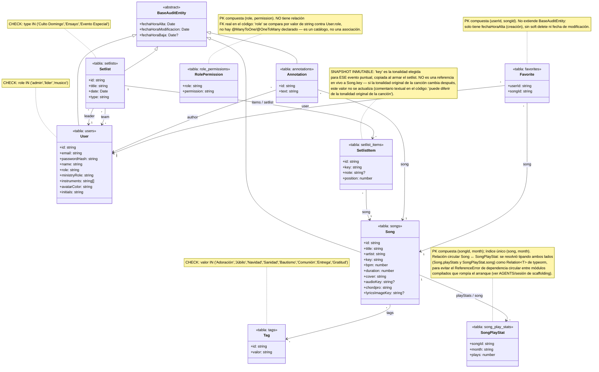

# Diagrama de clases — modelo de datos

Generado a partir de las entidades TypeORM reales en `src/**/*.entity.ts` (no es un diseño aspiracional: refleja el código tal como quedó scaffoldeado). Las columnas de auditoría (`fechaHoraAlta`, `fechaHoraModificacion`, `fechaHoraBaja`) se muestran una sola vez en `BaseAuditEntity` en vez de repetirse en cada entidad que la extiende.

## Notas sobre fidelidad al código

- **Todas las entidades listadas existen literalmente** como archivos `*.entity.ts` bajo `src/modules/**` y `src/common/authorization/`: `Song`, `SongPlayStat`, `User`, `Setlist`, `SetlistItem`, `Annotation`, `Favorite`, `Tag`, `RolePermission`. No hay ninguna entidad adicional en el proyecto.
- **`BaseAuditEntity`** no es una tabla propia (no tiene `@Entity`): es la clase abstracta de `src/common/entities/base-audit.entity.ts` que `User`, `Song`, `Setlist` y `Annotation` extienden. `SetlistItem`, `SongPlayStat`, `Tag`, `RolePermission` y `Favorite` **no** la extienden — `Favorite` sólo tiene su propio `fechaHoraAlta`, y el resto no tiene ninguna columna de auditoría.
- **Todas las relaciones son unidireccionales salvo dos**: `Song ↔ SongPlayStat` (vía `Song.playStats` / `SongPlayStat.song`) y `Setlist ↔ SetlistItem` (vía `Setlist.items` / `SetlistItem.setlist`) son las únicas con `@OneToMany` + `@ManyToOne` declarados en ambos lados. El resto (`Song.tags`, `Setlist.leader`, `Setlist.team`, `SetlistItem.song`, `Annotation.song`, `Annotation.author`, `Favorite.user`, `Favorite.song`) sólo tiene el decorador en un lado — el otro lado del código no declara ningún campo inverso.
- **`RolePermission` no está unida por clave foránea** a `User`: su columna `role` es un `varchar` que se compara por valor contra `User.role` en `AuthorizationService`, no hay relación TypeORM entre ambas entidades.
- El único snapshot inmutable real del modelo es `SetlistItem.key`, documentado como tal en el propio código.
